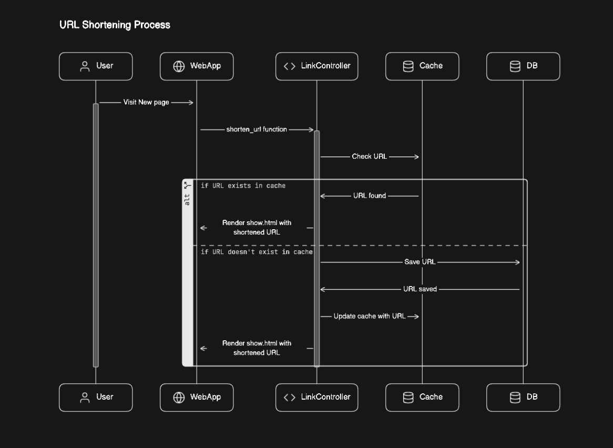

# ShortenedUrl

ShortenedUrl is a Phoenix application that provides functionality for creating, displaying, and managing shortened URLs. It offers features such as URL shortening, statistics tracking, CSV report generation, and rate-limiting.

## Project Description

The Shortened URL Controller handles the logic for creating, displaying, and managing shortened URLs. It interacts with the Shortened URL Elixir application to perform operations such as URL shortening, retrieving statistics, and generating CSV reports.

### Controller Functions

- **New:** Renders a form to create a new shortened URL [`localhost:4000`](http://localhost:4000).
- **Show:** Displays the original URL and redirects to it. Updates visit counts.
- **Shorten URL:** Shortens a provided URL and caches it for quick access. Renders a page with the shortened URL.
- **Stats:** Retrieves statistics about shortened URLs from the database and renders them in a web page [`localhost:4000/stats`](http://localhost:4000/stats).
- **Download CSV:** Generates a CSV file containing information about shortened URLs and sends it as a downloadable attachment.

### Dependencies

The controller relies on the Shortened URL Elixir application, which provides functionalities for generating slugs, caching URLs, and managing link data in the database. It also interacts with the Slug module for generating slugs, the Links module for managing link data, and the ShortenedUrl.Cache module for caching URL mappings.

#### Dependencies Used:

- **Elixir:** The core programming language for the application.
- **Phoenix Framework:** Provides the web framework for building the application.
- **Ecto:** Database wrapper and query generator for Elixir applications.
- **PostgreSQL:** Database management system used for storing link data.
- **UUID:** Library for generating universally unique identifiers for Slug.
- **Cachex:** A caching library for Elixir applications.
- **RateLimiter:** Library for implementing rate limiting functionality in the application.

## Usage 
Users can access the "New" page to create a shortened URL by providing the original URL.
The "Show" page displays the original URL and redirects users to it while updating visit counts.
Statistics about shortened URLs can be viewed on the "Stats" page.
Users can download a CSV report containing detailed information about shortened URLs using the "Download CSV" functionality.

## WorkFlow

## Getting Started

To start the Phoenix server:

1. Install dependencies with `mix deps.get`.
2. Create and migrate your database with `mix ecto.setup`, `mix ecto.migrate`.
3. Start the Phoenix endpoint with `mix phx.server` or inside IEx with `iex -S mix phx.server`.

You can then visit [`localhost:4000`](http://localhost:4000) from your browser to access the application.

## Testing

The project includes comprehensive test coverage for all components, including the modal schema, context files, libraries, and controllers. Clients can run tests using the `mix test` command.

## Learn More

Explore more about Phoenix:

- Official website: [https://www.phoenixframework.org/](https://www.phoenixframework.org/)
- Guides: [https://hexdocs.pm/phoenix/overview.html](https://hexdocs.pm/phoenix/overview.html)
- Documentation: [https://hexdocs.pm/phoenix](https://hexdocs.pm/phoenix)
- Forum: [https://elixirforum.com/c/phoenix-forum](https://elixirforum.com/c/phoenix-forum)
- Source Code: [https://github.com/phoenixframework/phoenix](https://github.com/phoenixframework/phoenix)

Feel free to contribute to this project and join the Phoenix community!
